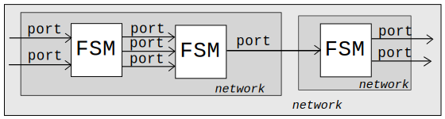
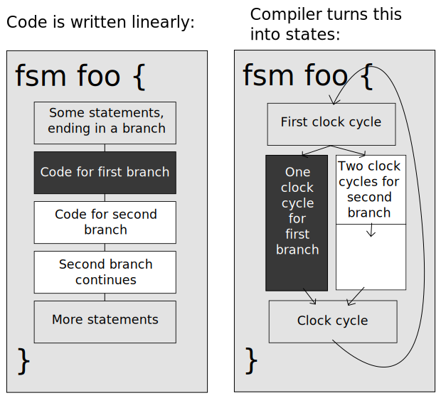

<p align="center">
Previous |
<a href="index.md">Index</a> |
<a href="compilation.md">Next</a>
</p>

# Basic concepts and examples 

### Introduction

The Alogic language is used for the description of digital circuits. In its
simplest form, an Alogic design could be a network of FSMs, connected
together (and/or connected to external sources) using input and output ports. In
this way, systems such as pipelines or other complex modules can be built.



An individual Alogic component is called a [design entity](entities.md) (for
example, a [Finite State Machine](fsms.md) or a [Network](networks.md)). These
are analogous to Verilog `modules` in that they can be instantiated inside other
entities to build a design hierarchy. FSMs can be instantiated inside networks,
which can in turn be instantiated inside other networks.

### Control Units

Within an FSM, Alogic code is written as a series of sequential control units,
with one control unit being executed per clock cycle. Transfer from one control
unit to the next (achieved using Alogic keywords or events) is a change of
state, and the design can branch out into different control units using
branching statements. The states themselves are not mentioned within Alogic and
instead are added by the compiler. As a result, FSMs are written in a locally
linear way and appear similar to common software programming languages.



### Alogic Prerequisites

The designer will need knowledge of:
- Flow control
- The difference between combinational and registered logic
- Software languages such as C

### Alogic Documentation

The Alogic documentation is a comprehensive guide to understanding and designing
Alogic code. Amongst other details, it explains how to use different [types of
entities](entities.md), how to connect them with [ports](ports.md), and the
range of [statements](statements.md) and [data types](types.md) that can be
used.

### Example FSM

The following code demonstrates an FSM with 4 states:

<a href="http://afiddle.argondesign.com/?example=concepts_example_fsm.alogic">Fiddle with this code here.</a>

```
fsm foo {
  void main() {
  
    // At this point we are in state 0
    u8 a = ...; // a is an unsigned 8-bit value
    u8 b = a + 7; // b is an unsigned 8-bit value
    
    // 'if' statements can occur within a Control Unit:
    if (a[0] == 1'b0) {
        a[0] = 1'b1;
    }
    // We are still in state 0
    
    fence; // This ends a Control Unit - the state will change.
    
    // We are now in state 1. Code continues to be executed linearly.
    b += 8'd1;
    
    if (b[2:0] == 3'b0) {
      doit(); // This function call ends the Control Unit and we transition to state 3.
    } // An implicit else here also ends the Control Unit and we transition to state 2.
    
    // We are now in state 2.
    a += 3;

    fence; // Control returns to the top of main, state 0.
  }

  void doit() {
    // At this point we are in state 3
    ...
    return; // Control returns to the state which follows the call site, state 2. 
  }
}
```

### Ports

Communication between entities happens through well defined interfaces called
[ports](ports.md). A port carries some (usually registered) payload signals,
and optionally some flow control signals with well-defined semantics.

A simple example of a module that, on every clock cycle, reads an 8 bit value
from an input port using a valid-ready handshake and adds a quasi-static value
to it is as follows:

<a href="http://afiddle.argondesign.com/?example=concepts_ports.alogic">Fiddle with this code here.</a>

```
fsm add {
  in sync ready u8 p_in; // Input port, registered, with a valid-ready handshake.
  in u8 addend; // No flow control

  out sync ready u8 p_out; // Output port, registered, with a valid-ready handshake.

  void main() {
    u8 sum = p_in.read() + addend;
    p_out.write(sum);
    fence;
  }
}
```

<p align="center">
Previous |
<a href="index.md">Index</a> |
<a href="compilation.md">Next</a>
</p>
