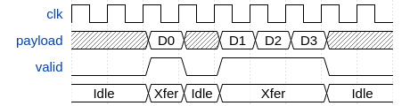
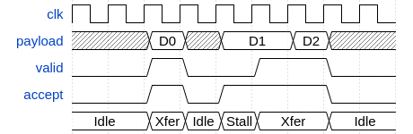

# Ports

### Communication between entities

Alogic uses the concept of ports to communicate across entity boundaries.
A port is declared in an entity body, introduced by the `in` or `out` keywords.
The simplest ports are analogous to Verilog module ports:

```
fsm foo {
  in u7 p_in_a;
  out u14 p_out_b;

  ...
}
```

This is roughly equivalent to a Verilog module with the following interface:

```verilog
module foo (
  input wire clk,
  input wire rst_n,

  input wire [6:0] p_in_a;
  output reg [13:0] p_out_b;
)
	...
endmodule
```

Ports can have any type, including structure types, and `void`.

The generic syntax for an input port declaration is:
- `in` keyword
- optionally followed by a flow control specifier
- followed by a data type
- followed by the name of the port
- followed by `;`

```
'in' flow_control? type IDENTIFIER;
```

Output ports are declared with the same syntax as input port, but using the
`out` keyword, and can additionally provide a storage specifier. The generic
syntax is:
- `out` keyword
- optionally followed by a flow control specifier
- optionally followed by a storage specifier
- followed by a data type
- followed by the name of the port
- followed by `;`

```
'out' flow_control? type IDENTIFIER;
```

### Flow control signals

One example where Alogic raises the abstraction level from Verilog is the use
of ports with standard flow control signaling. A port should be thought of as
a bundle of signals called the **payload** going in a **forward** direction. In
the case of input ports, the payload signals are being driven (written0) outside
the entity, and are consumed (read) inside the entity that defines them, so
'forward' means incoming. With output ports, this is reversed. Output ports are
driven by the entity that defines them, and are consumed outside the entity, so
the 'forward' direction on output ports means outgoing. In addition to the
payload, the port can have further **flow control** signals, which are either
driven in the same direction as the payload if they are forward signals, or
driven the opposite way if they are **backward** signals.

The following flow control specifiers are supported:
- `sync` results in an additional **valid** signal
- `sync ready` results in additional **valid** and **ready** signals
- `sync accept` results in additional **valid** and **accept** signals

The _valid_ signals are driven in the forward direction, while the _ready_ and
_accept_ signals are driven in the backward direction of the port.

### Flow control semantics

The following description of flow control semantics is of prime importance
to designers wanting to integrate compiled Alogic entities with native Verilog
modules. While the Alogic compiler takes care of synthesizing the necessary
signaling to respect flow control semantics, it is important that the designer
understands what the various flow control specifiers compile into, and when and
how they need to be used.

#### Ports without flow control

Ports defined without any flow control specifier have no additional signals
apart from the payload signals determined by the port type. These are analogous
to Verilog module interface ports (though note the section on Output Storage
below), and can change their values arbitrarily at any cycle.

#### Immediate single cycle transactions using `sync` ports

`sync` ports have an additional _valid_ signal that is active high for a single
clock cycle when there is a valid datum on the payload signals. It is the
responsibility of the consumer of the payload to handle the data as necessary
whenever the _valid_ signal is high. The data transfer is complete immediately
after the rising edge of the clock if the _valid_ signal is high. Consecutive
clock cycles with _valid_ high indicate the transfer of multiple data items.

<!-- <script type="WaveDrom">
{ signal : [
  { name: "clk",  		wave: "p........" },
  { name: "payload",  wave: "x.2x222x.",	data: "D0 D1 D2 D3" },
  { name: "valid", 		wave: "0.101..0." },
  { name: "", 				wave: "2.222..2.", 	data: "Idle Xfer Idle Xfer Idle"},
]}
</script> -->



#### Back pressure using `sync ready`

To provide back pressure from the consumer, `sync ready` flow control can be
used. This results in both a _valid_ and a _ready_ signal being generated for
the port. Data is valid on the payload, whenever the _valid_ signal is high, but
data transfer is completed only if _valid_ & _ready_ are both high on the same
clock cycle. The consumer can **stall** a transfer by keeping _ready_ low. It is
a requirement for payload signals to stay stable across clock cycles whenever
 _valid_ is high but _ready_ is low.

 <!-- <script type="WaveDrom">
 { signal : [
  { name: "clk",  		wave: "p........" },
  { name: "payload",  wave: "x.2x2.2x.",	data: "D0 D1 D2" },
  { name: "valid", 		wave: "0.101..0." },
  { name: "ready", 		wave: "0.10.1.0." },
	{ name: "", 				wave: "2.2222.2.", 	data: "Idle Xfer Idle Stall Xfer Idle"},
 ]}
 </script> -->

 

#### Avoiding combinatorial loops with `sync accept`

`sync accept` ports are functionally similar to `sync ready` ports. They are
included to avoid combinatorial signal dependencies in tight data paths where
outputs are driven from combinatorial logic rather than registers. There is
an important distinction between `sync ready` and `sync accept` on who is
considered the initiator of the data transfer. With `sync ready` ports, the
producer is in charge of initiating transactions, while with `sync accept`
ports, it is the consumer who initiates transactions. The producer can hold off
a transfer by keeping _valid_ low. The consumer must guarantee that if
_accept_ is high, then valid data (indicated by _valid_ high) will be accepted
at the rising edge of the clock. This distinction between `sync ready` and
`sync accept` ports might seem subtle at this point, but the following sections
on flow control signal dependencies and data path branches should clarify the
importance of this difference.

<!-- <script type="WaveDrom">
{ signal : [
 { name: "clk",  		  wave: "p........" },
 { name: "payload",   wave: "x.2x2.2x.",	data: "D0 D1 D2" },
 { name: "valid", 		wave: "0.10.1.0." },
 { name: "accept", 		wave: "0.101..0." },
 { name: "", 				  wave: "2.2222.2.", 	data: "Idle Xfer Idle Stall Xfer Idle"},
]}
</script> -->



### Flow control signal dependencies

When thinking about combinatorial logic used to generate the _valid_, _ready_,
and _accept_ signals, the following rules must be adhered to:

1. For a `sync ready` port, the _valid_ signal cannot depend combinatorially on
   the _ready_ signal.
2. For a `sync accept` port, the _accept_ signal cannot depend combinatorially
   on the _valid_ signal.

Or phrasing the same as permissive statements:

1. For a `sync ready` port, the _ready_ signal can depend combinatorially on the
   _valid_ signal.
2. For a `sync accept` port, the _valid_ signal can depend combinatorially on
   the _accept_ signal.

Important note: There is no requirement for the _ready_ signal to be low when
the corresponding _valid_ signal is low. i.e.: A combinatorial dependence from
_valid_ to _ready_ is permitted, but not necessary. Similarly, the _valid_
signal is not required to be low whenever the corresponding _accept_ signal is
low.

### Port access

Expressions are able to access data from an input port using the `.read()`
method:

```
  in sync u4 p_in;

  ...

  x = p_in.read() + 4'd3;
```

An output port can be updated using the `.write()` method, which takes as a
single argument the value to output on the port (writes to `void` ports take
no arguments):

```
  out sync i4 p_out;

  ...

  p_out.write(y - 4'sd1);
```

Using the `.read()` and `.write()` methods, the compiler will ensure that logic
is updated only when a port has a valid transaction as defined by the flow
control signal semantics, by stalling FSMs and other ports as necessary.

### Direct port access

It is possible to access input signals directly, by referencing the name of a
port on its own, but this method does not take notice of flow control signals.
It is usually reasonable to use direct port access only for ports without flow
control.

```
  in bool p_flag;

  ...

  if (p_flag) {
    ...
  }
```

Since `p_flag` has no flow control, the `if` statement in the previous example
could have been written `if (p_flag.read())`, and would behave the same way,
however this would not be true if `p_flag` had any other flow control type.

TODO: `.lock()`/`.unlock()`

### Output storage

Every output port has an associated output storage element, which by default
is a register. The following output storage types are supported

#### Output payload is registered by default

Without an explicit storage specifier in the port declaration, every output port
has an associated register that drives the output payload signals. This means
that there is a 1 cycle delay from inputs to outputs. Backward flow control
signals are not registered by default, and in particular, there can be a
combinatorial path from output port _ready_ signals (which are input signals
in the synthesized Verilog modules) to input port _ready_ signals (which are
output signals in the synthesized Verilog modules). The port can otherwise
sustain 1 transfer per cycle and hence has full throughput.

```
  out sync p_out;
```

TODO: Draw output stage

#### Combinatorial outputs

The keyword `wire` specifies no output storage element. All output signals
are driven combinatorially in the synthesized Verilog modules. This means there
is not sequential delay to the outputs, but there can be a number of
combinatorial paths from inputs to outputs of the synthesized Verilog module.

```
  out sync accept wire p_out_comb;
```

TODO: Draw output stage

#### Half throughput registered outputs

The storage specifier `bubble` denotes a registered output similar to the
default registered storage. With `bubble` output ports, backward flow control
signals are also registered, and therefore there are no combinatorial paths
through any of the port interface signals (payload or any flow control signals).
The registering of the backward flow control signals in a `bubble` output means
it can handle a transaction only on every other clock cycle.

```
  out sync ready bubble p_out_bubble;
```
TODO: Draw output stage

### Example use of flow control and output storage specifiers

#### Data path convergence

TODO: Example 2 to 1 arbiter with `sync ready`

#### Data path divergence

TODO: Example 1 to 2 dispatcher with `sync accept`

#### Tight coupling between entities

TODO: Example for `sync ready` / `sync accept wire` between 2 entities

### Summary or port methods

TODO:

<!-- <script src="https://cdnjs.cloudflare.com/ajax/libs/wavedrom/1.4.1/skins/default.js" type="text/javascript"></script>
<script src="https://cdnjs.cloudflare.com/ajax/libs/wavedrom/1.4.1/wavedrom.min.js" type="text/javascript"></script>
<script>
WaveDrom.ProcessAll()
</script> -->
