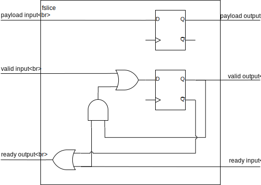

# Ports

### Communication between entities

Alogic uses the concept of ports to communicate across entity boundaries. A port
is declared in an entity body, introduced by the `in` or `out` keywords. The
simplest ports are analogous to Verilog module ports:

```
fsm foo {
  in u7 p_in_a;
  out u14 p_out_b;

  ...
}
```

This is roughly equivalent to a Verilog module with the following interface:

```verilog
module foo (
  input wire clk,
  input wire rst_n,

  input wire [6:0] p_in_a;
  output reg [13:0] p_out_b;
)
  ...
endmodule
```

Ports can have any type, including structure types. Ports that utilize flow
control can also be declared type `void`.

The generic syntax for an input port declaration is:
- `in` keyword
- optionally followed by a flow control specifier
- followed by a data type
- followed by the name of the port
- followed by `;`

```
'in' flow_control? type IDENTIFIER;
```

Output ports are declared with the same syntax as input port, but using the
`out` keyword, and can additionally provide a storage specifier. The generic
syntax is:
- `out` keyword
- optionally followed by a flow control specifier
- optionally followed by a storage specifier
- followed by a data type
- followed by the name of the port
- followed by `;`

```
'out' flow_control? storage_specifier? type IDENTIFIER;
```

In the following sections, we describe the flow control semantics used by
Alogic. After this discussion, we will introduce the syntax used to work with
Alogic ports.

### Flow control signals

One example where Alogic raises the abstraction level from Verilog is the use of
ports with standard flow control signaling. A port should be thought of as a
bundle of signals called the **payload** going in a **forward** direction. In
the case of input ports, the payload signals are being driven (written) outside
the entity, and are consumed (read) inside the entity that defines them, so
'forward' for input ports means incoming. With output ports, this is reversed.
Output ports are driven by the entity that defines them, and are consumed
outside the entity, so the 'forward' direction on output ports means outgoing.
In addition to the payload, the port can have further **flow control** signals,
which are either driven in the same direction as the payload if they are forward
signals, or driven the opposite way if they are **backward** signals.

The following flow control specifiers are supported:
- `sync` results in an additional **valid** signal
- `sync ready` results in additional **valid** and **ready** signals

The _valid_ signals are driven in the forward direction, while _ready_ signals
are driven in the backward direction of the port.

### Flow control semantics

The semantics of flow control signals, are of prime importance to designers
wanting to integrate compiled Alogic entities with native Verilog modules. While
the Alogic compiler takes care of synthesizing the necessary signaling to
respect flow control semantics, it is important that the designer understands
what the various flow control specifiers compile into, and when and how they
need to be used.

#### Ports without flow control

Ports defined without any flow control specifier have no additional signals
apart from the forward going payload signals determined by the port type. These
ports are analogous to Verilog module interface ports (though note the section
on Output Storage below), and can change their values arbitrarily at any cycle.

#### Immediate single cycle transactions using `sync` ports

`sync` ports have an additional forward going _valid_ signal that is active high
for a single clock cycle when there is a valid datum on the payload signals. It
is the responsibility of the consumer of the payload to handle the data as
necessary whenever the _valid_ signal is high. The data transfer is complete
immediately after the rising edge of the clock, if the _valid_ signal is high.
Consecutive clock cycles with _valid_ high indicate the transfer of multiple
data items.

<!--
{ signal : [
  { name: "clk",      wave: "p........" },
  { name: "payload",  wave: "x.2x222x.", data: "D0 D1 D2 D3" },
  { name: "valid",    wave: "0.101..0." },
  { name: "",         wave: "2.222..2.", data: "Idle Xfer Idle Xfer Idle"},
]}
-->


#### Back pressure using `sync ready`

To provide back pressure from the consumer, `sync ready` flow control can be
used. This results in both a forward going _valid_ and a backward going _ready_
signal being generated for the port. Data is valid on the payload signals,
whenever the _valid_ signal is high, but data transfer is completed only if
_valid_ & _ready_ are both high on the same clock cycle. The consumer can
**stall** a transfer by keeping _ready_ low. It is a requirement for payload
signals to stay stable across clock cycles whenever _valid_ is high but _ready_
is low.

<!--
{ signal : [
  { name: "clk",     wave: "p........" },
  { name: "payload", wave: "x.2x2.2x.",	data: "D0 D1 D2" },
  { name: "valid",   wave: "0.101..0." },
  { name: "ready",   wave: "0.10.1.0." },
  { name: "",        wave: "2.2222.2.", data: "Idle Xfer Idle Stall Xfer Idle"},
]}
-->

 

### Flow control signal dependencies

When thinking about combinatorial logic used to generate the _valid_ and
_ready_ signals, the following convention must be adhered to:

For any interface using _valid_/_ready_ flow control, as in a `sync ready` port,
the _valid_ signal cannot depend combinatorially on the _ready_ signal of the
same interface.

Or phrasing the same as a permissive statement:

For any interface using _valid_/_ready_ flow control, as in a `sync ready` port,
the _ready_ signal can depend combinatorially on the _valid_ signal.

The purpose of this convention is to avoid combinatorial loops, where a circuit
is computing a _ready_ signal based on a _valid_ signal, and a connected circuit
is trying to compute the same _valid_ signal based on the same _ready_ signal,
yielding a combinatorial loop which might or might not settle.

Important note: There is no requirement for the _ready_ signal to be low when
the corresponding _valid_ signal is low. i.e.: A combinatorial dependence from
_valid_ to _ready_ is permitted, but not necessary.

### Input port access

The simplest way of consuming the value of an input port is to use the `.read()`
method:

```
  in sync u4 p_in;
  ...
  x = p_in.read() + 4'd3;
```

The `.read()` method can be used in sequential code, and returns the value of
the payload signals.

For ports with flow control, the `.read()` method has the side effect of
stalling the entity when the _valid_ signal is low, and with `sync ready` ports,
raising the _read_ signal when required. This means that `.read()` methods on
ports with flow control are blocking in the sense that they will stall the
entity until a transaction is available.

### Output port access

An output port can be updated using the `.write()` method, which takes as a
single argument the value to output on the port (writes to `void` ports take
no arguments):

```
  out sync i4 p_out;
  ...
  p_out.write(y - 4'sd1);
```

The `.write()` method has the return type `void`, and as such must be used in
statement position (i.e.: it cannot be part of an expression).

For ports with flow control, the `.write()` method has the side effect of
setting the _valid_ signal high when appropriate. Similarly to the `.read()`
method, on ports with `sync ready` flow control, the `.write()` method is
blocking in the sense that the FSM will stall if a transaction is already
present in the output slice (see sections below about Output storage).

Output ports without flow control can also be assigned directly, which is
equivalent to the corresponding `.write()` call.

```
  out bool a;
  ...
  a = true; // Same as "a.write(true);"
```

### Direct port access

It is possible to access input port payload directly, by referencing the name of
a port on its own. This method does not take notice of flow control signals, and
is simply a reference to the current value of the input port payload signals. It
is usually reasonable to use direct port access only for ports without flow
control.

```
  in bool p_flag;
  ...
  if (p_flag) {
    ...
  }
```

For ports without flow control, using the `.read()` method has the exact same
effect as using direct port access. In the above example, as `p_flag` has no
flow control, the `if` statement could have been written `if (p_flag.read())`,
and would behave the same way, however this would not be true if `p_flag` had
any other flow control type.

Similarly to input ports, it is also possible to reference the payload signals
of output ports directly, which evaluates to the current value of the output
signals:

```
  out u4 number;
  
  void main() {
    number = 4'd3;
    fence;
    number = number * number;
    fence;
  }
```

### Checking port state

Ports with `sync` and `sync ready` flow control provide the `.valid` property
to check the state of the _valid_ signal of the port. This can be used both on
input ports, where it evaluates to the state of the _valid_ signal coming into
the entity, and on output ports, where it resolves to the _valid_ signal being
driven from the entity.

One important use of testing port state is non-blocking read/write from ports
with flow control: 

```
fsm nonblocking {
  in sync ready void p_in;

  u32 cycles = 32'd0;
  u32 transactions = 32'd0;

  void main() {
    cycles++;

    if (p_in.valid) {
      transactions++;
      p_in.read();
    }
    fence;
  }
}
```

The FSM defined above never stalls, as `p_in.read()` is guarded by the `if`
statement. If the guarding `if` statement was omitted, the variables `cycles`
and `transactions` would always have the same value, as lack of a transaction
on `p_in` would cause the entity to stall, preventing the update of any state,
including `cycles`.

### Waiting for transactions without consuming them

The `.wait()` method can be used on `sync ready` input ports to wait for an
incoming transaction. This stalls state machines until the _valid_ signal on the
corresponding port becomes high.

```
  in sync void start;

  void main() {
    start.wait();

    // do_something
    ...
  }
```

When combined with direct port access, this is useful for saving area by
not copying wide buses into local flops when processing them over multiple
cycles:

```
fsm stepdown {
  in  sync ready u1024 huge;
  out sync ready  u256 less;

  void main() {
    huge.wait();
    less.write(huge[  0 +: 256]);
    fence;
    less.write(huge[256 +: 256]);
    fence;
    less.write(huge[512 +: 256]);
    fence;
    huge.read();
    less.write(huge[768 +: 256]);
    fence;
  }
}
```

### Output storage

Every output port has an associated output storage element. The possible storage
elements depend on the flow control type of the output port. The following
combinations are possible.

#### Output ports without flow control

Output ports without flow control are driven from a local flop by default, which
is updated by the FSM:

```
fsm registered {
 out bool a;
 
 void main() {
    a = false;
    fence;
    // a is now false
    a = true;
    fence;
    // a is now true
 }
}
```

Given that the entity output is driven from a register, the interface activity
of the FSM above would look like the following waveform:

<!--
{ signal : [
  { name: "clk",   wave: "p........" },
  { name: "rst_n", wave: "101......" },
  { name: "a",     wave: "x.x010101" },
]}
-->


The `wire` storage specifier can be used to omit the output register and drive
the output port combinatorially:

```
fsm combinatorial {
 out bool wire a;
 
 void main() {
    a = false;
    // a is now false
    fence;
    a = true;
    // a is now true
    fence;
 }
}
```

This would result in the following behaviour:

<!--
{ signal : [
  { name: "clk",   wave: "p........" },
  { name: "rst_n", wave: "101......" },
  { name: "a",     wave: "x.0101010" },
]}
-->


#### Output storage with `sync` ports

Similarly to ports without flow control, `sync` ports are driven from registers
by default, and can be declared combinatorial using the `wire` storage
specifier:

```
fsm syncports {
  out sync      bool a;
  out sync wire bool b;

  void main() {
    a = false;
    b = false;
    fence;
    a = true;
    b = true;
    fence;
    fence;
  }
}
```
 
<!--
{ signal : [
  { name: "clk",      wave: "p........" },
  { name: "rst_n",    wave: "101......" },
  { name: "a",        wave: "x.x01.01." },
  { name: "a__valid", wave: "x.01.01.0" },
  { name: "b",        wave: "x.01.01.0" },
  { name: "b__valid", wave: "x.1.01.01" },
]}
-->


#### Output slices with `sync ready` ports

`sync ready` output ports that use _valid_/_ready_ flow control are somewhat
different from ports without flow control and `sync` ports using only a _valid_
signal. `sync ready` ports use **output slices** as storage elements. The
purpose of output slices is twofold. Firstly, they provide a single transaction
worth of storage space, similar to registers on other output ports. Secondly,
and just as importantly they ensure there is no combinatorial dependency between
the internal _valid_ and _ready_ signals generated by the FSM. To help
understand the second purpose, consider the following illustration of the
implementation of FSMs:


In a general FSM, there can be a combinatorial data-path from any of the signals
incoming to any of the signals outgoing from the combinatorial logic cloud, this
includes _ready_ and _valid_ signals on ports. As we discussed earlier, a
combinatorial loop between the _valid_ and _ready_ signals of an interface must
be avoided. Output slices aid in this by ensuring that the _ready_ signal going
to the combinatorial cloud is itself not combinatorially dependent on the
corresponding _valid_ signal emanating from the combinatorial cloud.

Alogic supports 3 kinds of output slices:
- A forward slice can be defined using the `fslice` storage specifier
- A backward slice can be defined using the `bslice` storage specifier
- A half throughput slice can be defined using the `bubble` storage specifier

Without providing an explicit storage specifier, the default storage used for a
`sync ready` output port is an `fslice`:

```
fsm slices {
    out sync ready        u8 a; // `fslice` is the default
    out sync ready fslice u8 b; // Same as above
    out sync ready bslice u8 c;
    out sync ready bubble u8 d;
}
```

The forward and backward slices can sustain a peak throughput of 1 transaction
per cycle. They are named after the direction of signals that are driven from
registers. In an `fslice`, all forward going signals (that is the _payload_ and
_valid_ signals) are driven from registers. The structure of an `fslice` is
shown below:



The noteworthy properties of the `fslice` are that the output _payload_ and
_valid_ signals are driven from registers, and that there is a combinatorial
path from the incoming _ready_ signal to the _ready_ signal going to the
combinatorial cloud.

A backward register slice drives the backward flowing signals, namely the
_ready_ signal from registers. The structure of a `bslice` is show on the
following:


Most important, the _ready_ signal driven to the FSM combinatorial logic is
coming from a register, and as such there is no combinatorial path between the
incoming _ready_ and the outgoing _ready_ signals. If the local payload storage
is empty, then the forward going _payload_ is driven combinatorially from the
_payload_ incoming from the FSM combinatorial cloud. This means that a `bslice`
can be used for combinatorial output ports using `sync ready` flow control,
similarly to how the `wire` storage type can be used for ports without flow
control, or ports with `sync` flow control. If the local payload storage is
occupied, the datum in the local storage takes precedence over the payload
incoming from the FSM, and as such transaction ordering is maintained. The FSM
cannot push a new item into the `bslice`, until the local storage in is emptied
by being accepted by the reader of the output port. This means that there can be
a stall due to the local storage in a `bslice` being occupied, even if the
reader of the output port is accepting the transaction on the same cycle.

Note that the full throughput `fslice` and `bslice` break the combinatorial
dependency between the input and output interfaces in only the forward and
backward directions respectively. The half throughput `bubble` slice shown on
the figure below can sustain only a 50% utilization, i.e.: a transaction is only
possible on every other cycle, but has the benefit that both the forwards and
backward signals are driven from registers, breaking the combinatorial path in
both directions. For this reason, wherever an output port does not need to
sustain more than 50% utilization, use of a `bubble` slice is recommended.


#### Instantiating multiple output slices

With `sync ready` output ports, it is possible to specify multiple output slices
to be instantiated for a single output port, by adding multiple repetitions of
the `fslice`, `bslice` and `bubble` keywords. The slices are connected back to
back, with the slice specified with the first keyword being driven from the FSM
combinatorial logic, and the slice denoted by the last keyword driving the
output signals of the entity. This can be used to add small amount of extra
buffering on output ports as required:

```
  out sync ready u8 fslice fslice a; 
```

Another important use of multiple output slices is the combination of a `bslice`
and a `fslice` in order to break the combinatorial paths in both the forward and
backward directions, while maintaining the possibility of 100% utilization:

```
  out sync ready u8 bslice fslice a;
```

There is no restriction on the number of register slices a `sync ready` output
port can specify, but timing and area implications of using multiple slices
should be considered by the designer.

#### Checking status of output slices

The status of output slices can be checked using the `.empty` and `.full`
properties. `.empty` evaluates to true, if and only if the local storage
register on all output slices instantiated for that port are empty. Similarly
`.full` is true if and only if the local storage register in all output slices
of that port are occupied. For output ports instantiating only a single output
slice, `.full` is the negation of `.empty`, but this of course does not hold for
output ports with multiple output slices.

The further property `.space` can be used to test the occupancy of a particular
output slice of the port. `.space` is a bit vector with as many elements as
there are output slices instantiated for that port. The LSB corresponds to the
first output slice, i.e.: the slice closes to the internals of the FSM, and the
MSB of `.space` corresponds to the output slice driving the interface signals of
the entity. A `.space` bit being true indicates that the local storage register
in that slice is not occupied. For output ports using a single output slice,
`.space[0]` is the same as `.empty`.

#### Flushing output slices

The `.flush()` method can be used on `sync ready` output ports. This stalls the
entity until the output slices of the port become empty, and can be used to
ensure all output produced up to that point have been consumed be the reader of
the output port.

### Summary of port methods and properties

The following table summarizes the methods and properties available on various
ports. `T` stands for the declared type of the port, and `N` is the number of
output slices instantiated for the output port:

| Direction | Flow control | Method/property | Type         | Notes                                                                           |
|:----------|:-------------|:----------------|:-------------|---------------------------------------------------------------------------------|
| `in`      |              | `.read()`       | void => T    | Same as referencing the port directly                                           |
| `in`      | `sync`       | `.read()`       | void => T    | Stalls if _valid_ is low                                                        |
| `in`      | `sync`       | `.valid`        | bool         | Evaluates to state of the input _valid_ signal                                  |
| `in`      | `sync ready` | `.read()`       | void => T    | Stalls if _valid_ is low, raises _ready_                                        |
| `in`      | `sync ready` | `.valid`        | bool         | Evaluates to state of the input _valid_ signal                                  |
| `in`      | `sync ready` | `.wait()`       | void => void | Stalls if _valid_ is low                                                        |
| `out`     |              | `.write(_)`     | T => void    | Same as direct assignment to the port                                           |
| `out`     | `sync`       | `.write(_)`     | T => void    | Sets _valid_ high                                                               |
| `out`     | `sync`       | `.valid`        | bool         | Evaluates to state of the output _valid_ signal                                 |
| `out`     | `sync ready` | `.write(_)`     | T => void    | Push transaction to output slice, stalls if first output slice is not available |
| `out`     | `sync ready` | `.valid`        | bool         | Evaluates to state of the output _valid_ signal                                 |
| `out`     | `sync ready` | `.flush()`      | void => void | Stalls if the output slices are not empty                                       |
| `out`     | `sync ready` | `.empty`        | bool         | True if and only if all output slices are empty                                 |
| `out`     | `sync ready` | `.full`         | bool         | True if and only if all output slices are occupied                              |
| `out`     | `sync ready` | `.space`        | bool[N]      | Indicating occupancy of each output slice                                       |

