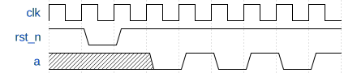

<p align="center">
<a href="literals.md">Previous</a> |
<a href="index.md">Index</a> |
<a href="params.md">Next</a>
</p>

# Ports

### Communication between entities

Alogic uses the concept of ports to communicate across entity boundaries. A port
is declared in an entity body, introduced by the `in` or `out` keywords. The
simplest ports are analogous to Verilog module ports:

<a href="http://afiddle.argondesign.com/?example=ports_communication.alogic">Fiddle with this code here.</a>

```
fsm foo {
  in u7 p_in_a;
  out u14 p_out_b;

  ...
}
```

This is roughly equivalent to a Verilog module with the following interface:

```verilog
module foo (
  input wire clk,
  input wire rst_n,

  input wire [6:0] p_in_a;
  output reg [13:0] p_out_b;
)
  ...
endmodule
```

Ports can have any type, including structure types. Ports that utilize flow
control can also be declared type `void`.

The generic syntax for an input port declaration is:
- `in` keyword
- optionally followed by a flow control specifier
- followed by a data type
- followed by the name of the port
- followed by `;`

```
'in' flow_control? type IDENTIFIER;
```

Output ports are declared with the same syntax as input port, but using the
`out` keyword, and can additionally provide a storage specifier. The generic
syntax is:
- `out` keyword
- optionally followed by a flow control specifier
- optionally followed by a storage specifier
- followed by a data type
- followed by the name of the port
- followed by `;`

```
'out' flow_control? storage_specifier? type IDENTIFIER;
```

In the following sections, we describe the flow control semantics used by
Alogic, and then we introduce the syntax used to work with Alogic ports.

### Flow control signals

One example where Alogic raises the abstraction level from Verilog is the use of
ports with standard flow control signaling. A port should be thought of as a
bundle of signals called the **payload** going in a **forward** direction. In
the case of input ports, the payload signals are being driven (written) outside
the entity, and are consumed (read) inside the entity that defines them, so
'forward' for input ports means incoming. With output ports, this is reversed.
Output ports are driven by the entity that defines them, and are consumed
outside the entity, so the 'forward' direction on output ports means outgoing.
In addition to the payload, the port can have further **flow control** signals,
which are either driven in the same direction as the payload if they are forward
signals, or driven the opposite way if they are **backward** signals.

The following flow control specifiers are supported:
- `sync` results in an additional **valid** signal
- `sync ready` results in additional **valid** and **ready** signals

The `valid` signals are driven in the forward direction, while `ready` signals
are driven in the backward direction of the port.

### Flow control semantics

The semantics of flow control signals are of prime importance to designers
wanting to integrate compiled Alogic entities with native Verilog modules. While
the Alogic compiler takes care of synthesizing the necessary signaling to
respect flow control semantics, it is important that the designer understands
what the various flow control specifiers compile into, and when and how they
need to be used.

#### Ports without flow control

Ports defined without any flow control specifier have no additional signals
apart from the forward going payload signals determined by the port type. These
ports are analogous to Verilog module interface ports (though note the section
on Output Storage below), and can change their values arbitrarily at any cycle.

#### Immediate single cycle transactions using `sync` ports

`sync` ports have an additional forward going `valid` signal that is active high
for a single clock cycle when there is a valid datum on the payload signals. It
is the responsibility of the consumer of the payload to handle the data as
necessary whenever the `valid` signal is high. The data transfer is complete
immediately after the rising edge of the clock, if the `valid` signal is high.
Consecutive clock cycles with `valid` high indicate the transfer of multiple
data items.

<!--
{ signal : [
  { name: "clk",      wave: "p........" },
  { name: "payload",  wave: "x.2x222x.", data: "D0 D1 D2 D3" },
  { name: "valid",    wave: "0.101..0." },
  { name: "",         wave: "2.222..2.", data: "Idle Xfer Idle Xfer Idle"},
]}
-->


#### Back pressure using `sync ready`

To provide back pressure from the consumer, `sync ready` flow control can be
used. This results in both a forward going `valid` and a backward going `ready`
signal being generated for the port. Data is valid on the payload signals,
whenever the `valid` signal is high, but data transfer is completed only if
`valid` & `ready` are both high on the same clock cycle. The consumer can
**stall** a transfer by keeping `ready` low. It is a requirement for payload
signals to stay stable across clock cycles whenever `valid` is high but `ready`
is low.

<!--
{ signal : [
  { name: "clk",     wave: "p........" },
  { name: "payload", wave: "x.2x2.2x.",	data: "D0 D1 D2" },
  { name: "valid",   wave: "0.101..0." },
  { name: "ready",   wave: "0.10.1.0." },
  { name: "",        wave: "2.2222.2.", data: "Idle Xfer Idle Stall Xfer Idle"},
]}
-->

 

### Flow control signal dependencies

When thinking about combinational logic used to generate the `valid` and
`ready` signals, the following convention must be adhered to:

For any interface using `valid`/`ready` flow control, as in a `sync ready` port,
the `valid` signal cannot depend combinationally on the `ready` signal of the
same interface.

Or phrasing the same as a permissive statement:

For any interface using `valid`/`ready` flow control, as in a `sync ready` port,
the `ready` signal can depend combinationally on the `valid` signal.

The purpose of this convention is to avoid combinational loops, where a circuit
is computing a `ready` signal based on a `valid` signal, and a connected circuit
is trying to compute the same `valid` signal based on the same `ready` signal,
yielding a combinational loop which might or might not settle.

Important note: There is no requirement for the `ready` signal to be low when
the corresponding `valid` signal is low. i.e.: A combinational dependence from
`valid` to `ready` is permitted, but not necessary.

### Input port access

The simplest way of consuming the value of an input port is to use the `.read()`
method:

<a href="http://afiddle.argondesign.com/?example=ports_input.alogic">Fiddle with this code here.</a>

```
  in sync u4 p_in;
  ...
  x = p_in.read() + 4'd3;
```

The `.read()` method can be used in sequential code, and returns the value of
the payload signals. On a single clock cycle, a port could be read multiple
times and will keep returning the same value.

For ports with flow control:

- If the `valid` signal is low, the `.read()` method has the side effect of
stalling the entity. This means that `.read()` methods on ports with flow
control are blocking in the sense that they will stall the entity until a
transaction is available.

- If the port is `sync ready`, the `.read()` method will raise the `ready`
signal to high, thus allowing the data to be consumed.

### Output port access

<a href="http://afiddle.argondesign.com/?example=ports_output.alogic">Fiddle with these code samples here.</a>

An output port can be updated using the `.write()` method, which takes as a
single argument the value to output on the port (writes to `void` ports take
no arguments):

```
  out sync i4 p_out;
  ...
  p_out.write(y - 4'sd1);
```

The `.write()` method has the return type `void`, and as such must be used in
statement position (i.e.: it cannot be part of an expression). On a single clock
cycle, it could be used more than once and would simply overwrite the previous
value. The value will not be committed until the end of the clock cycle.

For ports with flow control:

- The `.write()` method has the side effect of setting the `valid` signal high
when appropriate.

- If the port is `sync ready`, if `ready` is low, the `.write()` transaction can
still occur and the entity is not blocked. However, when the entity returns to
this state and attempts a further `.write()` transaction, it will then stall
until the previous transaction is no longer present in the output slice (see
sections below about Output storage).

Output ports without flow control can also be assigned directly, which is
equivalent to the corresponding `.write()` call.

```
  out bool a;
  ...
  a = true; // Same as "a.write(true);"
```

### Snooping on `sync ready` ports

A special port direction `snoop` is available for ports with `sync ready`
flow control. `snoop` ports treat all of the payload, `valid` and `ready`
signals as inputs to the declaring entity. They can be used to
monitor `sync ready` connections. `snoop` port provide the `.valid` and `.move`
attributes, which reference the `valid` signal, and `valid & ready`
respectively.

```
  snoop sync ready bool p;
  ...
  if (p.move) {
    ...
  }
```

### Direct port access

It is possible to access input port payload directly, by referencing the name of
a port on its own. This method does not take notice of flow control signals, and
is simply a reference to the current value of the input port payload signals. It
is usually reasonable to use direct port access only for ports without flow
control.

<a href="http://afiddle.argondesign.com/?example=ports_direct_in.alogic">Fiddle with this code here.</a>

```
  in bool p_flag;
  ...
  if (p_flag) {
    ...
  }
```

For ports without flow control, using the `.read()` method has the exact same
effect as using direct port access. In the above example, as `p_flag` has no
flow control, the `if` statement could have been written `if (p_flag.read())`,
and would behave the same way, however this would not be true if `p_flag` had
any other flow control type.

Similarly to input ports, it is also possible to reference the payload signals
of output ports directly, which evaluates to the current value of the output
signals:

<a href="http://afiddle.argondesign.com/?example=ports_direct_out.alogic">Fiddle with this code here.</a>

```
  out u4 number;

  void main() {
    number = 4'd3;
    fence;
    number = number * number;
    fence;
  }
```

### Checking port state

Ports with `sync` and `sync ready` flow control provide the `.valid` property
to check the state of the `valid` signal of the port. This can be used both on
input ports, where it evaluates to the state of the `valid` signal coming into
the entity, and on output ports, where it resolves to the `valid` signal being
driven from the entity.

One important use of testing port state is non-blocking read/write from ports
with flow control:

<a href="http://afiddle.argondesign.com/?example=ports_checking.alogic">Fiddle with this code here.</a>

```
fsm nonblocking {
  in sync ready void p_in;

  u32 cycles = 32'd0;
  u32 transactions = 32'd0;

  void main() {
    cycles++;

    if (p_in.valid) {
      transactions++;
      p_in.read();
    }
    fence;
  }
}
```

The FSM defined above never stalls, as `p_in.read()` is guarded by the `if`
statement. If the guarding `if` statement was omitted, the variables `cycles`
and `transactions` would always have the same value, as lack of an input value
on `p_in` would cause the entity to stall, preventing the update of any state,
including `cycles`.

To perform non-blocking writes on `sync ready` output port, test `space[0]`
to see if the closest register slice has space. Note that due to the way
`fslice` register slices are structured, and because the incoming ready signal
on an output slice is not observable (to avoid combinational loops), this
would only allow a write on every other cycle in the best case:

```
out sync ready fslice bool p_o;

void main() {
  if (p_o.space[0]) {
    p_o.write(true); // This fills the 'fslice' for the next cycle.
  }
}
```

To allow full throughput output ports with the above non-blocking write
pattern, use a `bslice`, or `bslice fslice` if required.

### Waiting for transactions without consuming them

The `.valid` property, combined with the `wait` statement can be used on
input ports to wait for an incoming transaction. This stalls state machines
until the `valid` signal on the corresponding port becomes high.

<a href="http://afiddle.argondesign.com/?example=ports_waiting.alogic">Fiddle with this code here.</a>

```
  in sync ready void start;

  void main() {
    wait start.valid;

    // do_something
    ...
  }
```

Using `a = p_in.read();` requires replicating the contents of `p_in` to create
the local flops for `a`. If `a` is very wide and the data will be used over
multiple cycles, it is more area efficient to use `wait p_in.valid`, followed
by direct port access to `p_in`. When the entity has finished using the data in
`p_in`, a `p_in.read();` statement can be used to consume the transaction.

<a href="http://afiddle.argondesign.com/?example=ports_stepdown.alogic">Fiddle with this code here.</a>

```
fsm stepdown {
  in  sync ready u1024 huge;
  out sync ready  u256 less;

  void main() {
    wait huge.valid;
    less.write(huge[  0 +: 256]);
    fence;
    less.write(huge[256 +: 256]);
    fence;
    less.write(huge[512 +: 256]);
    fence;
    huge.read();
    less.write(huge[768 +: 256]);
    fence;
  }
}
```

### Output storage

Every output port has an associated output storage element. The possible storage
elements depend on the flow control type of the output port. The following
combinations are possible:


Each of these options is now discussed in detail:

#### Output ports without flow control

Output ports without flow control are driven from a local flop by default, which
is updated by the FSM:

<a href="http://afiddle.argondesign.com/?example=ports_output_no_fc_flop.alogic">
Fiddle with this code here.</a>

```
fsm registered {
 out bool a;

 void main() {
    a = false;
    fence;
    // a is now false
    a = true;
    fence;
    // a is now true
 }
}
```

Given that the entity output is driven from a register, the interface activity
of the FSM above would look like the following waveform:

<!--
{ signal : [
  { name: "clk",   wave: "p........" },
  { name: "rst_n", wave: "101......" },
  { name: "a",     wave: "x.x010101" },
]}
-->



The `wire` storage specifier can be used to omit the output register and drive
the output port combinationally:

<a href="http://afiddle.argondesign.com/?example=ports_output_no_fc_comb.alogic">
Fiddle with this code here.</a>

```
fsm combinational {
 out wire bool a;

 void main() {
    a = false;
    // a is now false
    fence;
    a = true;
    // a is now true
    fence;
 }
}
```

This would result in the following behaviour:

<!--
{ signal : [
  { name: "clk",   wave: "p........" },
  { name: "rst_n", wave: "101......" },
  { name: "a",     wave: "x.0101010" },
]}
-->


#### Output storage with `sync` ports

Similarly to ports without flow control, `sync` ports (and their `valid`
signals) are also driven from registers (local flops in the FSM) by default.
They can also be declared combinationally using the `wire` storage specifier:

<a href="http://afiddle.argondesign.com/?example=ports_output_sync.alogic">
Fiddle with this code here.</a>

```
fsm syncports {
  out sync      bool a;
  out sync wire bool b;

  void main() {
    a.write(false);
    b.write(false);
    fence;
    a.write(true);
    b.write(true);
    fence;
  }
}
```

<!--
{ signal : [
  { name: "clk",      wave: "p........" },
  { name: "rst_n",    wave: "101......" },
  { name: "a",        wave: "x.x01.01." },
  { name: "a__valid", wave: "x.01.01.0" },
  { name: "b",        wave: "x.01.01.0" },
  { name: "b__valid", wave: "x.1.01.01" },
]}
-->


#### Output slices with `sync ready` ports

Unlike `sync` ports and ports with no flow control, `sync ready` output ports
are more complex and so the logic and storage for these is contained in
additional **output slices**. These contain a mixture of registers and
combinational logic connecting `valid` and `ready`. These are necessary to
ensure there is no combinational dependency between the internal `valid` and
`ready` signals generated by the FSM. Similarly to other registered output
ports, each output slice has space to store one payload item. This means a write
can occur even if the receiving module is not ready.  This means .write() can
sometimes be done without stalling the module.

Consider the following illustration of the implementation of FSMs:


In a general FSM, there can be a combinational data-path from any of the signals
incoming to any of the signals outgoing from the combinational logic cloud. This
includes `ready` and `valid` signals on ports. As we discussed earlier, a
combinational loop between the `valid` and `ready` signals of an interface must
be avoided. Output slices aid in this by ensuring that the `ready` signal going
to the combinational cloud is itself not combinationally dependent on the
corresponding `valid` signal emanating from the combinational cloud. This is
achieved through the use of registers and combinational logic within the
output slice.

Alogic supports 3 kinds of output slices:
- A forward slice can be defined using the `fslice` storage specifier
- A backward slice can be defined using the `bslice` storage specifier
- A half throughput slice can be defined using the `bubble` storage specifier

Without providing an explicit storage specifier, the default storage used for a
`sync ready` output port is an `fslice`:

<a href="http://afiddle.argondesign.com/?example=ports_output_sync_ready.alogic">
Fiddle with this code here.</a>

```
fsm slices {
    out sync ready        u8 a; // `fslice` is the default
    out sync ready fslice u8 b; // Same as above
    out sync ready bslice u8 c;
    out sync ready bubble u8 d;
}
```

The forward and backward slices can sustain a peak throughput of 1 transaction
per cycle. They are named after the direction of signals that are driven from
registers. In an `fslice`, all forward going signals (that is the `payload` and
`valid` signals) are driven from registers. The structure of an `fslice` is
shown below:


There is a storage register for the payload. Therefore, if the `valid` output is
low, then the storage register must be empty and so the `ready` output can be
raised (even if the `ready` input is low). Hence there is a combinational path
from the `ready` input signal to the `ready` output signal.

A backward register slice drives the backward flowing signals, namely the
`ready` signal from registers. The structure of a `bslice` is show on the
following:


This time, the `ready` signal driven to the FSM combinational logic is coming
from a register, so there is no combinational path between the `ready` input
and the `ready` output signals.

Similarly to the `fslice`, there is a storage register for the payload, but this
can be bypassed if `ready` input is high. Hence the output `payload` can be
driven combinationally, similarly to how the `wire` storage type can be used for
ports without flow control, or ports with `sync` flow control. If `ready` input
is low, the payload is transferred to the storage register.

If the local payload storage is occupied, the datum in the local
storage takes precedence over the payload incoming from the FSM, and as such
transaction ordering is maintained. The FSM cannot push a new item into the
`bslice`, until the local storage is emptied by being accepted by the reader
of the output port. This means that there can be a stall due to the local
storage in a `bslice` being occupied, even if the reader of the output port is
accepting the transaction on the same cycle.

Note that the full throughput `fslice` and `bslice` break the combinational
dependency between the input and output interfaces in only the forward and
backward directions respectively. The half-throughput `bubble` slice shown on
the figure below can sustain only a 50% utilization, i.e. a transaction is only
possible on every other cycle. This is because `valid` high on one cycle forces
the next cycle to be `valid` low. However, it has the benefit that both the
forwards and backwards signals are driven from registers, breaking the
combinational path in both directions. For this reason, wherever an output port
does not need to sustain more than 50% utilization, use of a `bubble` slice is
recommended.


#### Instantiating multiple output slices

With `sync ready` output ports, it is possible to specify multiple output slices
to be instantiated for a single output port, by adding multiple repetitions of
the `fslice`, `bslice` and `bubble` keywords. The slices are connected back to
back, with the slice specified with the first keyword being driven from the FSM
combinational logic, and the slice denoted by the last keyword driving the
output signals of the entity. This can be used to add small amount of extra
buffering on output ports as required:

```
  out sync ready fslice fslice u8 a;
```

Another important use of multiple output slices is the combination of a `bslice`
and a `fslice` in order to break the combinational paths in both the forward and
backward directions, while maintaining the possibility of 100% utilization (the
trade-off is that this approach requires twice as many flops as a bubble port):

```
  out sync ready bslice fslice u8 a;
```

There is no restriction on the number of register slices a `sync ready` output
port can specify, but timing and area implications of using multiple slices
should be considered by the designer.

#### Checking status of output slices

The status of output slices can be checked using the `.empty` and `.full`
properties. `.empty` evaluates to true, if and only if the local storage
register on all output slices instantiated for that port are empty. Similarly
`.full` is true if and only if the local storage register in all output slices
of that port are occupied. For output ports instantiating only a single output
slice, `.full` is the negation of `.empty`, but this of course does not hold for
output ports with multiple output slices.

The further property `.space` can be used to test the occupancy of a particular
output slice of the port. `.space` is a bit vector with as many elements as
there are output slices instantiated for that port. The LSB corresponds to the
first output slice, i.e.: the slice closes to the internals of the FSM, and the
MSB of `.space` corresponds to the output slice driving the interface signals of
the entity. A `.space` bit being true indicates that the local storage register
in that slice is not occupied. For output ports using a single output slice,
`.space[0]` is the same as `.empty`.

#### Flushing output slices

The `.empty` property, combined with the `wait` statement can be used on output
ports to ensure output storage has been flushed. The statement
`wait <port>.empty;` will stall the entity until the output slices of the port
become empty, and consequently ensures all outputs produced via that port up to
that point have been consumed by the reader of the output port.

### Initial state of output ports.

At reset, all flops driving an output `valid` signal are initialized such that
the `valid` signal on output ports will be low. Note that `valid` signals of
output ports that are driven combinationally from an FSM (i.e.: a `sync wire`
output port, or a `sync ready` output port with only `bslice` instances) might
still be high after reset, if the FSM entry state writes to those ports.

Ports without flow control that use the default register storage may have an
initializer expression to define their reset values. No initializer expression
is allowed in the declarations of any other kinds of ports.

```
  out u8 simple = 8'd5;
```

The same can be done for variables declared in entity scope - see
[FSMs](fsms.md).

### Cardinal ports

A cardinal port can be declared by omitting the name from the port declaration.
There can be at most one cardinal input port and one cardinal output port per
entity. Cardinal ports behave as if they were declared with the names `in` or
`out`, and as such they can be referred to with those keywords. The entity
can declare additional ordinary ports:

```
fsm cardinal_adder {
  in  u8;
  out u8;
  in  u8 addend;

  void main () {
    out = in + addend;
    fence;
  }
}
```

Cardinal ports behave exactly the same as ordinary ports, except in [port
connections](networks.md#connecting-cardinal-ports) where they are used
implicitly when referring to an instance of an entity, without naming a
particular port.

### Summary of port methods and properties

The following table summarizes the methods and properties available on various
ports. `N` is the number of output slices instantiated for the output port:

| Direction | Flow control | Method / property | Type         | Notes                                                                           |
|:----------|:-------------|:----------------|:-------------|---------------------------------------------------------------------------------|
| `in`      |              | `.read()`       | void => port type    | Same as referencing the port directly                                           |
| `in`      | `sync`       | `.read()`       | void => port type    | Stalls if `valid` is low                                                        |
| `in`      | `sync ready` | `.read()`       | void => port type    | Stalls if `valid` is low, raises `ready`                                        |
| `in`      | `sync` or `sync ready` | `.valid` | bool  | Evaluates to the state of the input `valid` signal                                 |
| `out`     |              | `.write(_)`     | port type => void    | Same as direct assignment to the port                                           |
| `out`     | `sync`       | `.write(_)`     | port type => void    | Sets `valid` high                                                               |
| `out`     | `sync ready` | `.write(_)`     | port type => void    | Push transaction to output slice, stalls if first output slice is not available |
| `out`     | `sync` or `sync ready` | `.valid` | bool      | Evaluates to the state of the output `valid` signal                                 |
| `out`     | `sync ready` | `.empty`        | bool         | True if and only if all output slices are empty                                 |
| `out`     | `sync ready` | `.full`         | bool         | True if and only if all output slices are occupied                              |
| `out`     | `sync ready` | `.space`        | bool[N]      | Indicates occupancy of each output slice                                       |

<p align="center">
<a href="literals.md">Previous</a> |
<a href="index.md">Index</a> |
<a href="params.md">Next</a>
</p>
